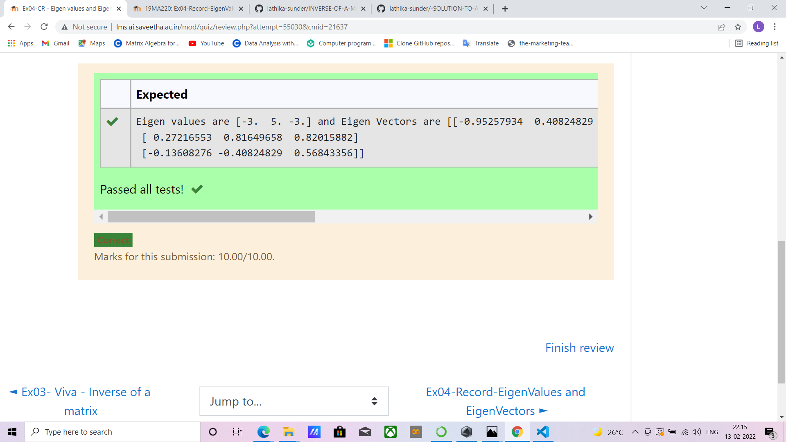

# EIGENVALUES-AND-EIGENVECTORS
## Aim:
To write a python program to find the Eigenvalues and Eigen Vectors
## Equipment’s required:
1. 	Hardware – PCs
2. 	Anaconda – Python 3.7 Installation / Moodle-Code Runner
## Algorithm:
### Step1 : 
Import numpy library using import statement. 
### Step 2: 
using np.array(), create an array for thr given matrix.
### Step 3:
Using the np.linalg.eig(),  we get two results (first is eigenvalue and second is eigenvector) of the given matrix.
### Step 4: 
Print both the resultant values using.format() and end the program.

## Program:
```
#Program to find the eigen values and eigen vectors.
#Developed by: Lathika Sunder
#RegisterNumber:212221230054
import numpy as np
a=np.array([[-2,2,-3],[2,1,-6],[-1,-2,0]])
values,vectors=np.linalg.eig(a)
print("Eigen values are",values,"and Eigen Vectors are",vectors)
```

## Output:

## Result:
Thus the Eigenvalue and Eigenvector is successfully solved using python program